<!DOCTYPE html>
<HTML>
<HEAD>
	<META charset="UTF-8">
</HEAD>
<BODY>

<H2 id="contents">Study09 README Contents</H2>
<H3>Research security</H3>

Java source code: 
 
 package 
	<a href="https://github.com/ee-eng-cs/Study09/tree/master/src/main/java/kp/">kp</a> 

Action: 
 
 1. Launch application with <I>"01 MVN exec.bat"</I> 

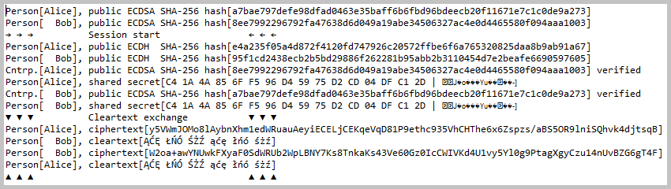 
<I>Console log from 'EllipticCurveCryptography.launch()' method.</I>

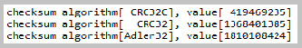 
<I>Console log from 'ChecksumsComputing.launch()' method.</I>

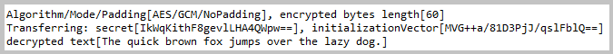 
<I>Console log from 'CiphersEncryptionAndDecryption.launchAES_GCM()' method.</I>

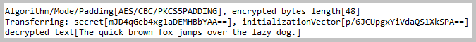 
<I>Console log from 'CiphersEncryptionAndDecryption.launchAES_CBC()' method.</I>

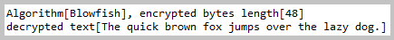 
<I>Console log from 'CiphersEncryptionAndDecryption.launchBlowfish()' method.</I>

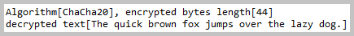 
<I>Console log from 'CiphersEncryptionAndDecryption.launchChaCha20()' method.</I>

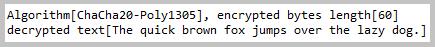 
<I>Console log from 'CiphersEncryptionAndDecryption.launchChaCha20_Poly1305()' method.</I>

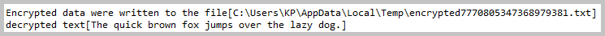 
<I>Console log from 'CiphersEncryptionAndDecryption.encryptToFileAndDecryptFromFile()' method.</I>

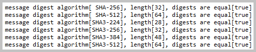 
<I>Console log from 'DigestsComputing.launch()' method.</I>

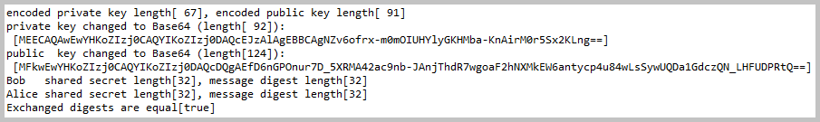 
<I>Console log from 'KeysAndDigestsExchanging.launch()' method.</I>

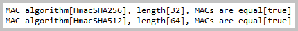 
<I>Console log from 'MacsComputing.launch()' method.</I>

 
<I>Console log from 'SecureClass.newSecureClass().launch()' method.</I>

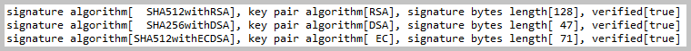 
<I>Console log from 'SignaturesSigning.launch()' method.</I>

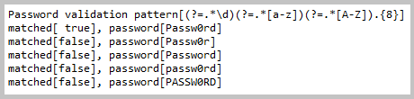 
<I>Console log from 'PasswordValidation.launch()' method.</I>

<A href="apidocs/index.html?overview-summary.html" >API Specifications</A>
(API was not commited to <B>GitHub</B>; this link should be active after local build with <I>'mvn javadoc'</I>)

</BODY>
</HTML>